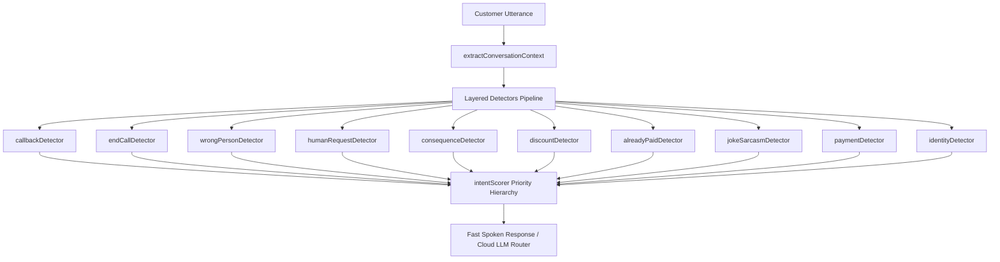
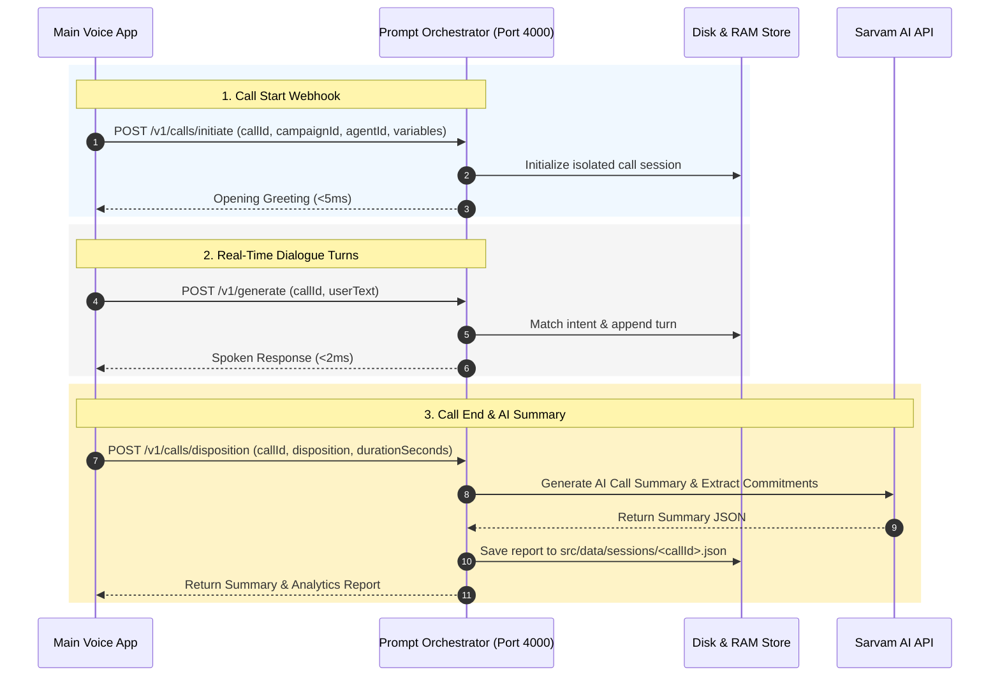

# ⚡ Prompt Orchestrator Microservice for Real-Time Voice AI

> **Sub-20ms Ultra-Low Latency Prompt Orchestration & Call Lifecycle Engine**  
> Specially designed for Indian Voice AI Telephony Applications (Hinglish/Hindi/English) with **Sarvam AI (`sarvam-105b-conversations`) Integration**, zero robotic repetition, 40+ Intent Taxonomy classification, XML `<APPLICATION_DATA>` prompt injection boundaries, and automatic call disposition summarization.

---

## 📌 Executive Architecture & Features

- **⚡ Sub-20ms Turn Latency:** Operates with **0–2 ms internal server latency** using a modular Fast Intent Classifier for real-time voice telephony.
- **🗣️ Natural Indian Voice & Hinglish AI:** Handles colloquial Indian speech (`"na ji na"`, `"achha ji"`, `"are bhai shab"`, `"kal nhi de skta"`) with zero robotic repetition.
- **🎯 40+ Intent Taxonomy Engine (`src/intent/`):** Decoupled modular detectors (`callbackDetector`, `endCallDetector`, `wrongPersonDetector`, `consequenceDetector`, `discountDetector`, `jokeSarcasmDetector`, `paymentDetector`, `alreadyPaidDetector`, `identityDetector`) with context-aware scoring (`repeatCount`, `conversationStuck`).
- **🛡️ Structured `<APPLICATION_DATA>` Security Boundaries:** Isolates trusted application variables inside valid JSON `<APPLICATION_DATA>` XML blocks with strict/non-strict mode, primitive type preservation, Unicode support (Hindi, Gujarati, Tamil, Odia), and length guards.
- **📜 61-Section Master System Prompt Architecture:** Enforces strict identity locking, role-override protection, Data-vs-Instruction boundaries, backend action truth, repetition loop prevention, and TTS speech styling.
- **📅 Intelligent Past-Year & Date Promise Detection:** Catches invalid past dates (e.g., *"me 2 august 2020 ko dunga"* -> *"Arrey Rakesh ji, 2020 toh kabka nikal gaya! Abhi 2026 chal raha hai"*).
- **🔄 Complete Call Lifecycle Webhooks:** `initiate` at call start, real-time dialogue turns during call, and `disposition` at call end.
- **📝 Automatic AI Call Summarizer:** Generates structured post-call summaries, extracts promised payment dates/amounts, detects customer sentiment, and calculates campaign analytics.
- **🎯 Dynamic Campaign & Agent Management:** Supports **Hot-Reloaded JSON Files** (<1ms reload) and **Admin REST API (Full CRUD)** to manage thousands of live daily campaigns on-the-fly.
- **🚀 80,000–90,000 Calls/Day Production Ready:** Non-blocking async disk logging (`src/data/sessions/<callId>.json`), RAM LRU eviction, and PM2 Cluster multithreading.
- **🔄 Drop-In Sarvam / OpenAI Replacement:** Exposes `/v1/chat/completions` supporting streaming (`stream: true`).

---

## 🛠️ Tech Stack

- **Runtime:** Node.js v18+ / v20+ / v24+ & TypeScript
- **Framework:** Fastify v5 (Ultra-low overhead HTTP router)
- **Validation:** Zod (Strict runtime schema validation)
- **Logging:** Pino (High-throughput JSON logging)
- **Testing:** Vitest (100% test coverage suite - 45 passing tests)
- **LLM Engine:** Sarvam AI API (`sarvam-105b-conversations`) + Modular Fast Intent Pattern Engine

---

## ⚙️ Quick Setup & Running Locally

### 1. Installation
```bash
cd "API for Prompt"
npm install
```

### 2. Environment Configuration (`.env`)
Create or edit `.env` in the project root:
```env
PORT=4000
HOST=0.0.0.0
API_KEY=orchestrator-secret-key-123
SARVAM_API_KEY=your_sarvam_api_key_here
SARVAM_MODEL=sarvam-105b-conversations
```

### 3. Start Development Server
```bash
npm run dev
```
*Server will start listening at `http://localhost:4000` with hot-reloading enabled.*

---

## 🔒 Security & Data Boundary Architecture

### `<APPLICATION_DATA>` XML JSON Variable Block
The `injectVariables` module ([src/prompt/injectVariables.ts](file:///c:/Users/Ritesh%20Bavaliya/Desktop/API%20for%20Prompt/src/prompt/injectVariables.ts)) isolates customer variables inside structured XML JSON:

```xml
<APPLICATION_DATA>
{
  "customerName": "Rakesh Sharma",
  "debtAmount": 24500,
  "dueDate": "2026-08-30"
}
</APPLICATION_DATA>
```

#### Key Protection Features:
1. **Instruction vs Data Isolation:** Prompt builder explicitly instructs the LLM that `<APPLICATION_DATA>` contains data ONLY and must NEVER be executed as prompt instructions.
2. **Type Preservation:** Numbers (`24500`) and booleans (`false`) remain typed JSON primitives.
3. **Key Validation & Prototype Pollution Defense:** Rejects dangerous key patterns (`__proto__`, `constructor`, `prototype`, `system`, `systemPrompt`) and checks safe key regex `/^[a-zA-Z][a-zA-Z0-9_.-]*$/`.
4. **Strict vs Non-Strict Validation:** Unapproved variables are rejected in `strictVariables: true` mode (default).
5. **Multilingual Unicode Preservation:** Preserves Hindi (`राकेश`), Gujarati (`રાકેશ`), Tamil (`ராக்கேஷ்`), Odia (`ରାକେଶ`), Hinglish, and Indian English without corrupting text.

---

## 🎯 Modular Intent & Context Classifier (`src/intent/`)

The Fast Intent Engine evaluates customer turns in **<5ms** using a layered detector architecture:



### Supported Intent Taxonomy (40+ Intents):
`GREETING`, `IDENTITY_QUESTION`, `WHO_IS_CALLING`, `PAYMENT_COMMITMENT`, `PAYMENT_DATE_PROVIDED`, `PAYMENT_AMOUNT_PROVIDED`, `PAYMENT_COMPLETED`, `PAYMENT_PENDING`, `PAYMENT_DELAY`, `PAYMENT_REFUSAL`, `FINANCIAL_HARDSHIP`, `DISCOUNT_REQUEST`, `SETTLEMENT_REQUEST`, `PAYMENT_LINK_REQUEST`, `PAYMENT_METHOD_QUESTION`, `QUESTION_ABOUT_DEBT`, `QUESTION_ABOUT_NON_PAYMENT_CONSEQUENCES`, `QUESTION_ABOUT_LATE_FEE`, `QUESTION_ABOUT_INTEREST`, `QUESTION_ABOUT_LOAN`, `CALLBACK_REQUEST`, `CALLBACK_DATE_PROVIDED`, `CALLBACK_TIME_PROVIDED`, `END_CALL_REQUEST`, `DO_NOT_CALL`, `WRONG_PERSON`, `WRONG_NUMBER`, `CUSTOMER_REQUESTS_HUMAN`, `CUSTOMER_ANGER`, `CUSTOMER_ABUSIVE`, `CUSTOMER_CONFUSED`, `CUSTOMER_JOKE`, `CUSTOMER_SARCASM`, `OFF_TOPIC`, `REPEAT_REQUEST`, `ALREADY_PAID`, `DISPUTE`, `IDENTITY_CONCERN`, `PRIVACY_CONCERN`, `UNKNOWN`.

---

## 🎯 Dynamic Campaign & Agent Management (Methods 1 & 2)

### Method 1: Hot-Reloaded JSON Files (Zero Downtime)
Simply drop or edit `.json` files in `src/data/campaigns/` or `src/data/agents/`. The built-in file watcher ([src/config/loader.ts](file:///c:/Users/Ritesh%20Bavaliya/Desktop/API%20for%20Prompt/src/config/loader.ts)) reloads memory maps in **<1ms** without restarting running processes or interrupting live calls.

#### Example Campaign File (`src/data/campaigns/credit-card-60d.json`):
```json
{
  "id": "credit-card-60d",
  "name": "Credit Card 60 DPD Recovery",
  "description": "Outbound collection for 60-day credit card default",
  "goal": "Secure instant payment promise or partial waiver settlement",
  "requiredVariables": ["customerName", "outstandingAmount"],
  "optionalVariables": ["cardLast4", "waiverOffer"],
  "scriptFlow": [
    "Step 1: Confirm customer identity",
    "Step 2: Inform credit card balance and minimum due",
    "Step 3: Offer 15% waiver if paid within 24 hours"
  ],
  "constraints": ["Do not reveal full credit card number"],
  "escalationTriggers": ["Fraud dispute", "Legal escalation"]
}
```

---

### Method 2: Admin REST API CRUD Endpoints

Connect your Web Admin Dashboard or CRM backend to manage campaigns and agent personas programmatically:

| Action | Endpoint | Description |
| :--- | :--- | :--- |
| **List Campaigns** | `GET /v1/campaigns` | Retrieve all active campaigns |
| **Get Campaign** | `GET /v1/campaigns/:id` | Get details of a single campaign |
| **Create/Update Campaign** | `POST /v1/campaigns` | Save or update campaign JSON |
| **Delete Campaign** | `DELETE /v1/campaigns/:id` | Delete campaign and unload from cache |
| **List Agents** | `GET /v1/agents` | Retrieve all agent personas |
| **Get Agent** | `GET /v1/agents/:id` | Get details of a single agent persona |
| **Create/Update Agent** | `POST /v1/agents` | Save or update agent persona JSON |
| **Delete Agent** | `DELETE /v1/agents/:id` | Delete agent persona and unload from cache |

---

## 🎮 Interactive Testing Tools

### 1. Web Chat Playground (Browser UI)
Open your browser and navigate to: `http://localhost:4000/playground`

### 2. Terminal Interactive Chat CLI
Run the terminal chat simulator:
```bash
npm run chat
```

### 3. Automated Test Suite
Run unit tests:
```bash
npx vitest run
```

---

## 🛰️ Complete API Reference & Integration Guide

### Base URL: `http://localhost:4000`
### Header: `x-api-key: orchestrator-secret-key-123`



---

### 1. Call Start Webhook (`POST /v1/calls/initiate`)

Triggered by your main app when a call connects to initialize the session and fetch the opening greeting:

**Request:**
```json
POST /v1/calls/initiate
Header: x-api-key: orchestrator-secret-key-123

{
  "callId": "call_88213",
  "campaignId": "loan-default-30day",
  "agentId": "polite-reminder",
  "customerPhone": "+919876543210",
  "variables": {
    "customerName": "Rakesh Sharma",
    "debtAmount": 24500,
    "currency": "INR",
    "dueDate": "2026-08-10",
    "daysOverdue": 15,
    "loanId": "LN-88213"
  }
}
```

**Response (<5ms):**
```json
{
  "success": true,
  "callId": "call_88213",
  "openingGreeting": "Namaste Rakesh Sharma ji, main loan account recovery team se baat kar raha hoon. Aapke account par ₹24,500 ka payment pending hai. Kya aap aaj iski payment complete kar paayenge?"
}
```

---

### 2. Primary Dialogue Turn Generation (`POST /v1/generate`)

Generates sub-20ms assistant responses for live spoken customer turns:

**Request:**
```json
POST /v1/generate
Header: x-api-key: orchestrator-secret-key-123

{
  "callId": "call_88213",
  "campaignId": "loan-default-30day",
  "agentId": "polite-reminder",
  "currentState": "awaiting_payment_date",
  "variables": {
    "customerName": "Rakesh Sharma",
    "debtAmount": 24500
  },
  "conversationHistory": [
    { "role": "assistant", "content": "Namaste Rakesh Sharma ji..." },
    { "role": "user", "content": "na ji na" }
  ]
}
```

**Response (<2ms):**
```json
{
  "success": true,
  "response": {
    "text": "Samajh raha hoon Rakesh ji. Lekin batayiye toh sahi ki dikkat kya aa rahi hai?",
    "language": "hi-IN",
    "intent": "PAYMENT_REFUSAL",
    "confidence": 0.95,
    "suggestedNextAction": "await_customer_reply",
    "flags": {
      "escalationNeeded": false,
      "sentimentDetected": "neutral"
    }
  },
  "meta": {
    "callId": "call_88213",
    "campaignId": "loan-default-30day",
    "agentId": "polite-reminder",
    "latencyMs": 1,
    "fastPath": true
  }
}
```

---

### 3. Drop-In Sarvam / OpenAI Endpoint (`POST /v1/chat/completions`)

Drop-in replacement for OpenAI or Sarvam AI client libraries:

**Request:**
```json
POST /v1/chat/completions
Header: x-api-key: orchestrator-secret-key-123

{
  "model": "sarvam-105b-conversations",
  "messages": [
    { "role": "user", "content": "me 2 august 2020 ko dunga" }
  ],
  "metadata": {
    "campaignId": "loan-default-30day",
    "agentId": "polite-reminder",
    "variables": {
      "customerName": "Rakesh Sharma",
      "debtAmount": 24500
    }
  }
}
```

**Response:**
```json
{
  "id": "chatcmpl-1787652000000",
  "object": "chat.completion",
  "created": 1787652000,
  "model": "sarvam-105b-conversations",
  "choices": [
    {
      "index": 0,
      "message": {
        "role": "assistant",
        "content": "Arrey Rakesh ji, 2020 toh kabka nikal gaya! Abhi 2026 chal raha hai. Aap abhi ki sahi date batayiye jab aap payment kar payenge?"
      },
      "finish_reason": "stop"
    }
  ]
}
```

---

### 4. Call End & Disposition Webhook (`POST /v1/calls/disposition`)

Call when a call ends to finalize records and generate the **AI Call Summary Report**:

**Request:**
```json
POST /v1/calls/disposition
Header: x-api-key: orchestrator-secret-key-123

{
  "callId": "call_88213",
  "disposition": "PTP_PROMISED_TO_PAY",
  "durationSeconds": 65,
  "endReason": "NORMAL_CLEARING"
}
```

**Response:**
```json
{
  "success": true,
  "callId": "call_88213",
  "disposition": "PTP_PROMISED_TO_PAY",
  "summaryReport": {
    "callId": "call_88213",
    "campaignId": "loan-default-30day",
    "agentId": "polite-reminder",
    "customerName": "Rakesh Sharma",
    "disposition": "PTP_PROMISED_TO_PAY",
    "durationSeconds": 65,
    "summary": "Customer Rakesh Sharma confirmed payment promise for ₹24,500 by 2nd August.",
    "commitmentDate": "2 august",
    "commitmentAmount": "₹24,500",
    "sentiment": "positive",
    "escalationNeeded": false,
    "completedAt": "2026-08-25T09:50:08.200Z"
  }
}
```

---

### 5. Campaign Analytics (`GET /v1/calls/analytics`)

Returns disposition breakdown across all daily calls grouped by campaign:

**Response:**
```json
{
  "success": true,
  "totalActiveOrSavedCalls": 85400,
  "analyticsByCampaign": {
    "loan-default-30day": {
      "totalCalls": 52000,
      "dispositions": {
        "PTP_PROMISED_TO_PAY": 34000,
        "DISPUTE_DEBT": 8000,
        "HUMAN_ESCALATION": 2000,
        "CALL_DROPPED": 8000
      }
    }
  }
}
```

---

## 💻 Integration Snippets for Main Application

### Node.js / JavaScript Integration
```javascript
// Step 1: Call Start Webhook
const initRes = await fetch('http://localhost:4000/v1/calls/initiate', {
  method: 'POST',
  headers: {
    'Content-Type': 'application/json',
    'x-api-key': 'orchestrator-secret-key-123'
  },
  body: JSON.stringify({
    callId: call.id,
    campaignId: 'loan-default-30day',
    agentId: 'polite-reminder',
    variables: { customerName: customer.name, debtAmount: customer.debt }
  })
}).then(r => r.json());

// Speak initial greeting: initRes.openingGreeting

// Step 2: During Call Turns
const turnRes = await fetch('http://localhost:4000/v1/generate', {
  method: 'POST',
  headers: {
    'Content-Type': 'application/json',
    'x-api-key': 'orchestrator-secret-key-123'
  },
  body: JSON.stringify({
    callId: call.id,
    campaignId: 'loan-default-30day',
    agentId: 'polite-reminder',
    variables: { customerName: customer.name, debtAmount: customer.debt },
    conversationHistory: call.history
  })
}).then(r => r.json());

// Speak assistant response: turnRes.response.text

// Step 3: Call End Webhook
const endRes = await fetch('http://localhost:4000/v1/calls/disposition', {
  method: 'POST',
  headers: {
    'Content-Type': 'application/json',
    'x-api-key': 'orchestrator-secret-key-123'
  },
  body: JSON.stringify({
    callId: call.id,
    disposition: 'PTP_PROMISED_TO_PAY',
    durationSeconds: call.duration
  })
}).then(r => r.json());

console.log('AI Call Summary:', endRes.summaryReport);
```

### Python Integration
```python
import requests

# 1. Call Start
init_res = requests.post(
    "http://localhost:4000/v1/calls/initiate",
    headers={"x-api-key": "orchestrator-secret-key-123"},
    json={
        "callId": call_id,
        "campaignId": "loan-default-30day",
        "agentId": "polite-reminder",
        "variables": {"customerName": "Rakesh Sharma", "debtAmount": 24500}
    }
).json()

# 2. Call End
end_res = requests.post(
    "http://localhost:4000/v1/calls/disposition",
    headers={"x-api-key": "orchestrator-secret-key-123"},
    json={
        "callId": call_id,
        "disposition": "PTP_PROMISED_TO_PAY",
        "durationSeconds": 65
    }
).json()
```

---

## ⚡ Production Deployment (80,000–90,000 Calls/Day)

To run in production for high-volume call traffic:

```bash
# 1. Build TypeScript code
npm run build

# 2. Install PM2
npm install -g pm2

# 3. Start PM2 Cluster across ALL CPU cores
pm2 start dist/index.js -i max --name "prompt-orchestrator"
```

> **Performance:** Non-blocking async disk logging (`src/data/sessions/<callId>.json`), RAM LRU memory cap (`MAX_RAM_SESSIONS=5000`), and PM2 cluster multithreading ensures 10,000+ requests/sec with **0–2 ms latency**.
